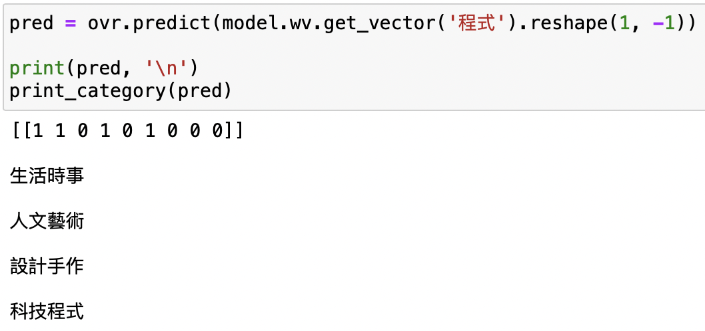
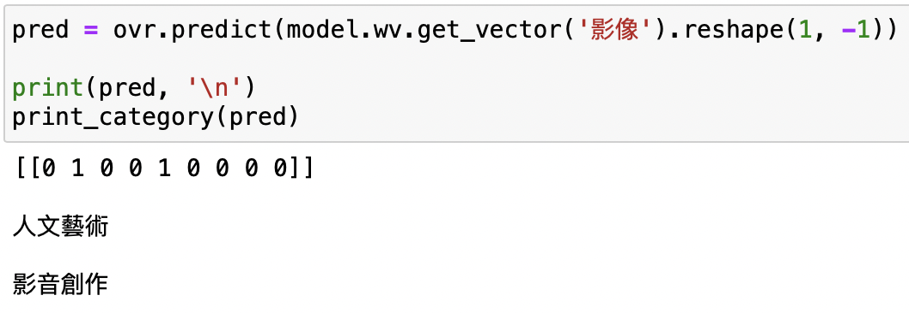

# text-analysis-project

## crawler_wordcut_forchuk.ipynb

*About code···*

1. Crawling all courses' information from [揪課](https://trevi.ctld.ncku.edu.tw/site/trevi_list)
2. Label for the classification is based on the 9 different types of courses on 揪課
3. Export all data from the result by the designed format

*What package I used?*

- `requests`
- `BeautifulSoup`
- `openpyxl`
- `jieba`

## single-label_words_classification.ipynb

*About code···*

1. sorting chinese words into 3 types : Business/Management, Science/Enginee and Medicine
2. Classification based on self-made label and *Logistic Regression*
3. Utilizing word2vec and setting the feature of a word as its vector

*What package I used?*

- `numpy`
- `Pandas`
- `sklearn`
- `keras`
- `gensim.models`

## multi-label_words_classification.ipynb

*About code···*

1. Based on the output from `crawler_wordcut_forchuk` to make classification
2. As *multi-label*, adopting *OneVsRestClassifier*
3. Utilizing word2vec and setting the feature of a word as its vector

*What package I used?*

- `numpy`
- `Pandas`
- `sklearn`
- `keras`
- `gensim.models`
- `openpyxl`

*Current Result*

「程式」此字被分類屬於在「生活時事」、「人文藝術」、「設計手作」、「科技程式」

「影像」此字被分類屬於在「人文藝術」、「影音創作」

